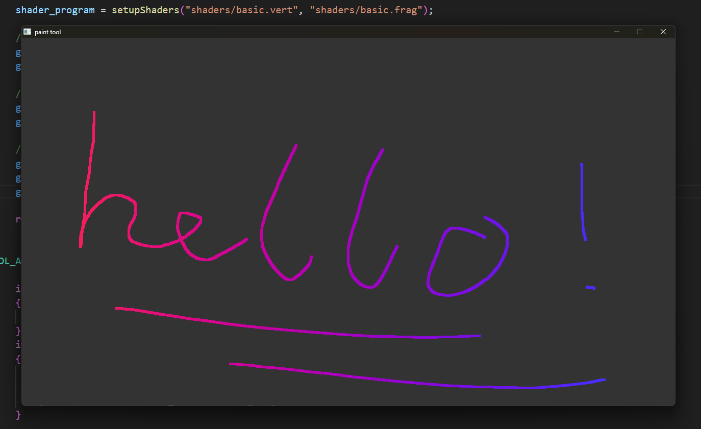

A small project being used to learn the basics of graphics programming. Currently a work in progress and extremely simple.



### Instructions
#### Clone the repo and submodules
``` bash
git clone https://github.com/floono/paint_tool.git
git submodule update --init --recursive
```
#### Build with CMake
``` bash
cmake -B build
cmake --build build
```
#### Run the executable from the root directory of the project

### Future ideas
- Convert the project to C++
  - Allows easier use of the imGui library
  - OOP De
